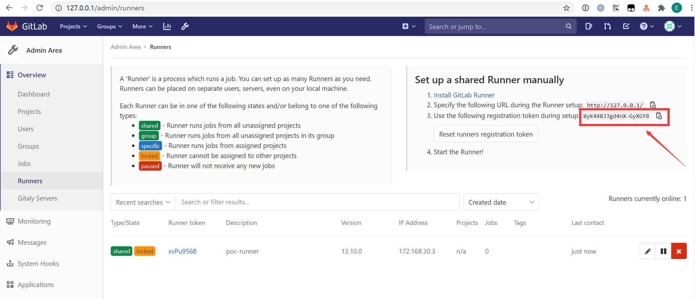

# CVE-2021-22192

> CVE-2021-22192 靶场： 未授权用户 RCE 漏洞

------

## 0x10 靶场环境

  


## 0x20 目录结构

```
CVE-2021-22192
├── README.md ............... [此 README 说明]
├── imgs .................... [辅助 README 说明的图片]
├── gitlab .................. [Gitlab 容器的挂载目录]
│   ├── Dockerfile .......... [Gitlab 的 Docker 构建文件]
│   ├── config .............. [Gitlab 配置挂载目录]
│   ├── data ................ [Gitlab 数据挂载目录]
│   ├── logs ................ [Gitlab 日志挂载目录]
│   ├── keys ................ [Gitlab 破解 License 存储目录]
│   └── nginx ............... [Gitlab 内置 nginx 配置目录]
├── runner .................. [Gitlab 容器的挂载目录]
├── license ................. [破解 License 的容器构建目录]
│   ├── Dockerfile .......... [License 的 Docker 构建文件]
│   └── license.rb .......... [生成破解 License 的 Ruby 脚本]
├── test .................... [Kramdown 调试目录]
├── docker-compose.yml ...... [Docker 的构建配置]
├── keygen.ps1 .............. [Windows: 一键生成破解 License]
├── keygen.sh ............... [Linux:   一键生成破解 License]
├── run.ps1 ................. [Windows: 一键运行 Gitlab 靶场]
├── run.sh .................. [Linux:   一键运行 Gitlab 靶场]
├── register.ps1 ............ [Windows: 一键注册 Runner]
├── register.sh ............. [Linux:   一键注册 Runner]
├── stop.ps1 ................ [Windows: 一键停止 Gitlab 靶场]
└── stop.sh ................. [Linux:   一键停止 Gitlab 靶场]
```


## 0x30 靶场搭建

### 0x31 构建

- 宿主机预装 docker 和 docker-compose
- 下载本仓库： [git clone https://github.com/lyy289065406/CVE-2021-22192](https://github.com/lyy289065406/CVE-2021-22192)
- 生成破解密钥对： [`./keygen.sh`](keygen.sh) 或 [`./keygen.ps1`](keygen.ps1)
- 构建并运行 Gitlab （确保 80 端口未占用）： [`./run.sh`](run.sh) 或 [`./run.ps1`](run.ps1)
- 约 5 分钟后可从浏览器登录 Gitlab：[http://127.0.0.1](http://127.0.0.1) （首次登录需要重设管理员账号 root 的密码）


### 0x32 破解

前面生成破解密钥对的时候，已经把公钥写入 Gitlab 容器后台了，还需要把私钥通过前端上传到 Gitlab 完成破解：

- 密钥对生成到 [`./gitlab/keys/`](gitlab/keys/) 目录，复制其下 `.gitlab-license` 的内容（私钥）
- 使用 root 用户打开 [http://127.0.0.1/admin/license/new](http://127.0.0.1/admin/license/new) 页面
- 选择 `Enter license key` 并粘贴私钥，点击 `Upload license` 按钮即可完成破解


### 0x33 设置 Runner

- 使用 root 用户打开 [http://127.0.0.1/admin/runners](http://127.0.0.1/admin/runners) 页面
- 找到 registration token 并复制
- 注册 Runner： [`./register.sh $TOKEN`](register.sh) 或 [`./register.ps1 $TOKEN`](register.ps1)

> 至此所有 Repository 都可以使用此 Runner 执行 CI 脚本（Pipeline Jobs）




## 0x40 靶场验证

> 暂未公开 PoC 和 EXP。

此漏洞发生在使用 jekyll 构建静态站点的过程中（构建过程发生在 gitlab-runner 中）。

推测漏洞注入点应该在 jekyll 的 _config.yml 配置文件，当指定使用 kramdown 作为 markdown 的解析引擎、同时采用 rouge 作为语法高亮插件时，通过构造 `syntax_highlighter_opts` 和 `formatter` 可以配合触发 CVE-2021-22192，例如：

```
kramdown:
    syntax_highlighter: rouge
    syntax_highlighter_opts:
    formatter: CSV
```


为测试效果，可以利用本靶场在本地搭建一个 Gitlab Pages 环境进行调试。


## 0x05 漏洞分析

Jekyll 是目前最为流行的 SSG（Static Site Generator） 之一，它被广泛应于 Gitlab Pages、Github Pages 以构建个人博客等静态站点。

漏洞披露后，Gitlab 在 kramdown 修复之前，马上就发布了临时修复补丁：[Patch Kramdown syntax highlighter gem](https://gitlab.com/gitlab-org/gitlab/-/commit/179329b5c3c118924fb242dc449d06b4ed6ccb66)。

从内容上看，修复的内容并不多，主要针对 kramdown Gem 包的 `Kramdown::Converter::SyntaxHighlighter` 进行了临时修复，并声明在 Kramdown 修复后应去掉这个补丁。

很快地，Kramdown 也修复了这个问题：[Restrict Rouge formatters to Rouge::Formatters namespace](https://github.com/gettalong/kramdown/commit/d6a1cbcb2caa2f8a70927f176070d126b2422760#diff-752a8043ae0220ab8bb4d8a91b3a623ad6775dd2ca958041cda185bc9f58d44a)，升级版本为 2.3.1（[版本说明](https://kramdown.gettalong.org/news.html)）。

> 为了方便分析，本仓库把 Kramdown 2.3.1 拉到了 [test](test/) 目录：`git clone --depth 1 --branch REL_2_3_1 https://github.com/gettalong/kramdown`


不难发现，只有一行代码被修复了：

```
::Rouge::Formatters.const_get(formatter)
```

修改为：

```
::Rouge::Formatters.const_get(formatter, false)
```

> const_get 是 ruby 类继承自 Object 的方法，关于入参是否有 `false` 的区别可参考[这篇文章](https://blog.csdn.net/dennis_zane/article/details/83288841)。


------

其实此漏洞与之前的 CVE-2020-14001 非常相似，利用位置也如出一辙，具体可以参考下这两篇文章：

- 《[通过 GitHub Pages 不安全的 Kramdown 配置实现多个RCE](https://www.anquanke.com/post/id/220964)》
- 《[Kramdown 配置不当引发 GitHub Pages 多个 RCE](https://blog.csdn.net/smellycat000/article/details/109302520)》


<details>
<summary>这里节选一部分分析：</summary>
<br/>

虽然看起来有点可疑的其它唯一一个选项是 `formatter_class`（被设为 `syntax_highlighter_opts` 的一部分），但它设置的验证是具有仅允许字母数字，然后使用 `:Rouge::Formatters.const_get` 查找:

```
def self.formatter_class(opts = {})
  case formatter = opts[:formatter]
  when Class
    formatter
  when /\A[[:upper:]][[:alnum:]_]*\z/
    ::Rouge::Formatters.const_get(formatter)
```

当时，我以为这样做很安全。

第二天晚上，我分析了 `:Rouge::Formatters.const_get` 的实际工作原理。结果发现它并没有像我原来想的那样将常量限制为 `::Rouge::Formatters`，可能会返回之前被定义的任意常量/类。虽然正则表达式仍然做出了限制（不允许 `::`），但它仍然可悲用于返回相当多的类。发现该常量时，它被用于创建一个新的实例，之后调用 format 方法：

```
formatter = formatter_class(opts).new(opts)
formatter.format(lexer.lex(text))
```

为测试效果，我编辑了 _config.yml，之后尝试构建该站点。

```
kramdown:
    syntax_highlighter: rouge
    syntax_highlighter_opts:
    formatter: CSV
```

虽然并未成功，但出错信息表明 CVS 类已创建！

```
jekyll 3.8.5 | Error:  private method `format' called for #<CSV:0x00007fe0d195bd48>
```

</details>


## 0x99 参考文章

- 《[用 Jekyll 在 GitLab pages 上搭建博客](https://www.chungkwong.cc/gitlab-jekyll.html)》
- 《[Jekyll 官方模板](https://gitlab.com/pages/jekyll)》
- 《[本地搭建的 GitLab 中开启 Pages 功能（无需域名）](https://blog.csdn.net/weixin_34304013/article/details/92671899)》
- 《[Syntax Highlighting With Rouge](https://kramdown.gettalong.org/syntax_highlighter/rouge.html)》

